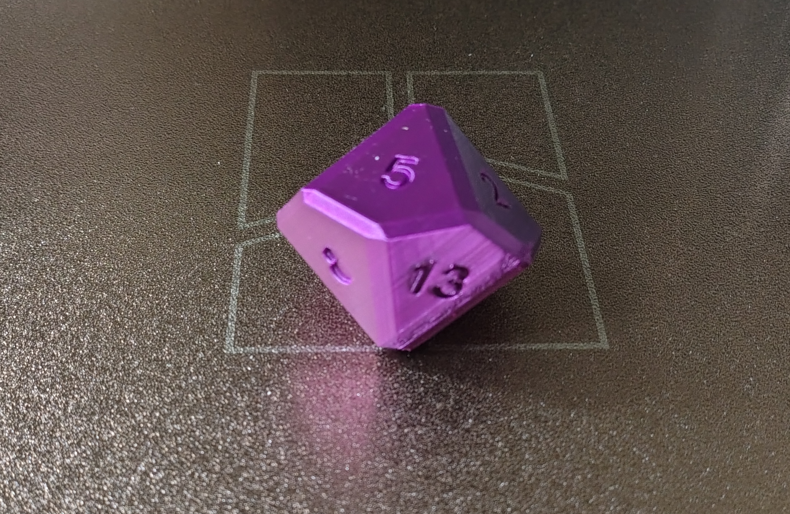

# The Honest Agile Estimator

*A transparent, auditable, and statistically competitive alternative to traditional Agile estimation techniques.*
*Because every estimate is ultimately based on incomplete information.*

A physically auditable story point estimation device for Agile teams.

## Overview

**The Honest Agile Estimator** is a 3D-printable estimation tool designed to support Agile teams during backlog refinement, sprint planning, and effort estimation activities.

The project consists of a ten-sided die (D10) featuring the most commonly used values from the Fibonacci-based story point scale:

| Face | Meaning |
|--------|--------|
| 0 | No effort required |
| 1 | Trivial task |
| 2 | Very small task |
| 3 | Small task |
| 5 | Medium task |
| 8 | Significant task |
| 13 | Large task |
| 21 | Very large task |
| ? | Insufficient information for estimation |
| ∞ | Too large, requires decomposition |

The model is provided as a 3D design suitable for manufacturing using standard FDM or resin-based 3D printers.

---

## Motivation

Software estimation remains one of the most challenging activities in modern software development.

Teams are often required to estimate work items involving:

- Unclear requirements
- Emerging technologies
- Legacy systems with undocumented behavior
- Third-party integrations
- Architectural refactoring
- Production incidents
- Tasks that "should be simple"

In such situations, extensive discussion can consume significant engineering time while still producing highly uncertain estimates.

The Honest Agile Estimator embraces a pragmatic approach by introducing a transparent and reproducible estimation mechanism whose statistical reliability is frequently comparable to more sophisticated methods.

---

## Typical Use Cases

### Sprint Planning

During sprint planning, a team needs to estimate twenty backlog items before the end of a one-hour meeting.

Rather than spending forty-five minutes debating whether a task is a 5 or an 8, the team may employ The Honest Agile Estimator to obtain a result in a matter of seconds.

### Legacy System Analysis

A user story requires modifications to a business-critical component originally developed in 2007 by developers who are no longer available.

After fifteen minutes of investigation, no team member understands how the system works.

The estimator can rapidly determine an appropriate story point value or indicate that the task should be represented by `?` or `∞`.

### Novel Technology Adoption

A team is evaluating a technology that nobody has previously used.

Traditional estimation approaches may provide an illusion of certainty. The Honest Agile Estimator avoids this risk by acknowledging uncertainty through a randomized but objective process.

### Architecture Discussions

When discussions about implementation complexity begin to exceed the expected implementation time itself, the estimator can be used to accelerate decision-making and preserve engineering productivity.

---

## Estimation Procedure

The following procedure should be followed to ensure consistent and repeatable estimation outcomes.

### Step 1 — Present the Work Item

Select the user story, technical task, bug report, spike, or epic to be estimated.

Read the description aloud.

### Step 2 — Technical Review

Allow the team to discuss:

- Requirements
- Dependencies
- Risks
- Unknowns
- Architecture implications
- Whether the task is actually three separate tasks

Continue until participants begin repeating arguments previously expressed.

### Step 3 — Prepare the Estimator

Place the Honest Agile Estimator on a stable and level surface.

Verify that all stakeholders can clearly observe the estimation process.

### Step 4 — Execute Estimation

Roll the estimator.

For enhanced governance, teams may choose to designate an official Estimation Officer responsible for the throw.

### Step 5 — Interpret the Result

Record the upper face value.

Possible outcomes are:

- **0** — No meaningful effort required.
- **1, 2, 3, 5, 8, 13, 21** — Story point estimate.
- **?** — Additional information is required before estimation can proceed.
- **∞** — The item should be split into smaller work items.

### Step 6 — Validate

If the outcome appears unreasonable, repeat Steps 3 through 5 until a satisfactory estimate is obtained.

This iterative process improves confidence while preserving methodological rigor.

---

## Governance and Compliance

The Honest Agile Estimator provides several advantages over traditional estimation techniques:

- Fully transparent decision process
- No proprietary algorithms
- No vendor lock-in
- No cloud dependency
- No AI hallucinations
- Easily auditable estimation history
- Compatible with Scrum, Kanban, SAFe, and most other estimation-heavy frameworks

---

## Manufacturing

The repository contains the source 3D model files required to manufacture the estimator.

Recommended materials include:

- PLA
- PETG
- ABS
- Any material deemed appropriate by your organization's estimation governance policies

Post-processing is optional but may improve estimation accuracy perception.

### Repository Contents

| File | Description |
|------|-------------|
| `dado-agile.f3d` | Autodesk Fusion source model |
| `agile-die.step` | STEP interchange file for CAD/CAM applications |

---

## Reference Hardware

The Honest Agile Estimator is implemented as a standards-compliant ten-sided estimation device.

The reference implementation shown above has been optimized for:
- High estimation throughput
- Low meeting overhead
- Excellent cross-functional team compatibility
- Deterministic compliance with the Fibonacci estimation scale

---

## Accuracy Statement

Internal testing demonstrates that The Honest Agile Estimator consistently produces estimates within the accepted Fibonacci scale and achieves 100% compliance with the selected estimation framework.

The estimator never produces invalid values and therefore guarantees process conformity.

---

## Disclaimer

The Honest Agile Estimator does not guarantee estimation accuracy.

However, empirical observations suggest that its results are often indistinguishable from estimates generated through substantially longer meetings.

Use responsibly.

---

## License

This project is released under the license specified in this repository.

Contributions, forks, improvements, and alternative estimation methodologies are welcome.